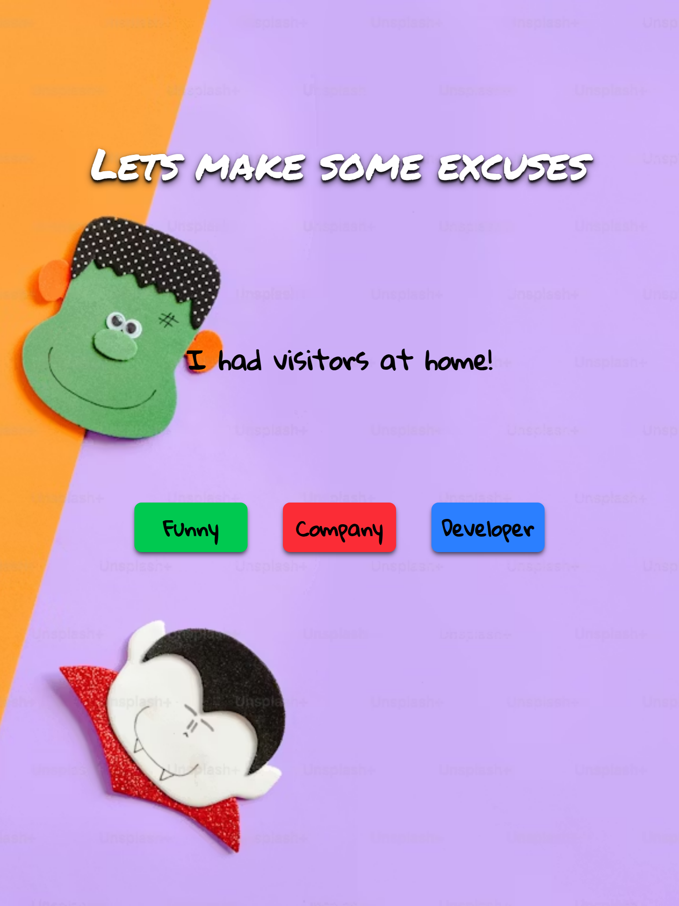

# Excuse Generator App

A simple React application that fetches random excuses from a public API and displays them in a clean user interface.  
This project focuses on **API integration**, **state management**, and **conditional rendering** in React.

---

## 🚀 Features

- Fetches random excuses from a public API
- Displays excuse category and message
- Button to generate a new excuse
- Clean and minimal UI
- Basic error handling

---

## 🛠 Tech Stack

- React
- Vite
- JavaScript (ES6+)
- CSS

---

## 📁 Project Structure

```

src/
├── App.jsx
├── main.jsx
├── index.css
├── assets/
│   └── react.svg

```

---

## 🔄 How It Works

1. The app initializes state to store the excuse data.
2. When the user clicks the **Generate Excuse** button, a request is sent to the public API.
3. The API response is saved in state.
4. The excuse category and message are displayed on the screen.

---

## 🌐 API Used

The app uses a public Excuse API.

Example response:

```json
{
  "category": "office",
  "excuse": "My dog ate my laptop charger."
}
```

---

## 📦 Installation & Setup

1. Clone the repository

```bash
git clone https://github.com/AljuSabu/Excuse-App
```

2. Navigate to the project folder

```bash
cd excuseApp
```

3. Install dependencies

```bash
npm install
```

4. Start the development server

```bash
npm run dev
```

5. Open in your browser

```
http://localhost:5173
```

---

## 🧠 Concepts Practiced

* React `useState`
* Fetching data from an API
* Event handling
* Conditional rendering
* Component-based architecture

---

## 🖼️ Screenshots

### Large Monitor


### Laptop


### Small Laptop


### Tablet


### Smartphone


### Live Preview

[live@]()

---

## 📄 License

This project is created for learning and practice purposes.

---